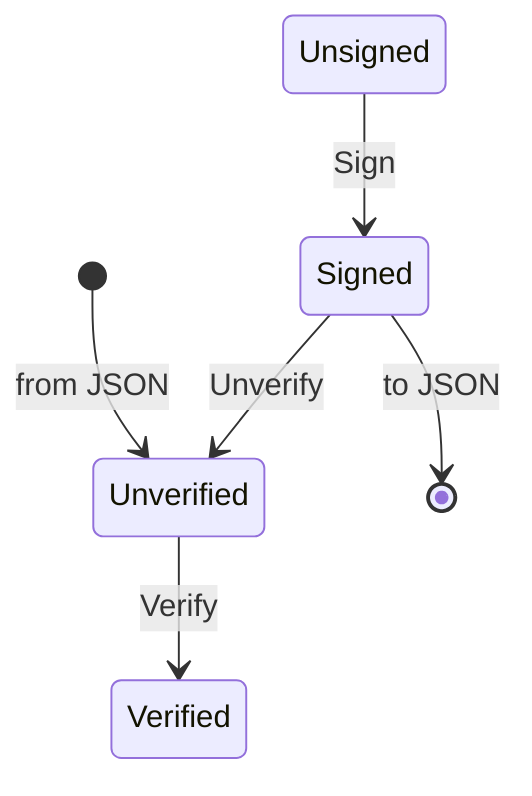

# JAWS: JSON Web tokens

JSON Web Tokens are used to send signed, authenticated and/or encrypted data using
a JavaScript Object Notation (JSON) object. This crate provides a strongly typed
interface for creating and validating [JWTs][JWT], built on top of the [RustCrypto][]
ecosystem.

## Example JWT

This is an example [JWT][], taken from the ACME standard ([RFC 8555][RFC8555]):

```json
{
  "protected": base64url({
    "alg": "ES256",
    "jwk": {...
    },
    "nonce": "6S8IqOGY7eL2lsGoTZYifg",
    "url": "https://example.com/acme/new-account"
  }),
  "payload": base64url({
    "termsOfServiceAgreed": true,
    "contact": [
      "mailto:cert-admin@example.org",
      "mailto:admin@example.org"
    ]
  }),
  "signature": "RZPOnYoPs1PhjszF...-nh6X1qtOFPB519I"
}
```

This JWT represents a request signed with an ECDSA key using the NIST P-256 curve (`ES256`).
The payload is a JSON object containing an account creation request for an ACME server.

Since ACME accounts are identified by the public half of an encryption key, the public key
used to encode this JWT is included in the JWT's headers as `jwk`, a JSON Web Key ([JWK][]).

JSON Web Tokens contain a protected header (`protected` above), which contains a number of
"registered" keys (in this case, `alg` and `jwk`), along with an arbitrary set of custom
keys. The payload is any JSON object, though the [JWT][] standard defines a set of claims
used for authentication, including some "registered" claims (claims are not used by [ACME][RFC8555]).

The signature is produced by computing the ECDSA signature over the concatenation of the
protected header and the payload, both base64url encoded, and separated with a period (`.`).

## Strongly Typed JWTs

JAWS provides a strongly typed interface for creating and validating JWTs. Tokens in JAWS
must be in one of 4 states:

1. [`Unsigned`][crate::token::Unsigned]: A token which has not been signed, and has no signature.
2. [`Signed`][crate::token::Signed]: A token which has been signed. Signed tokens can't be modified,
    as that could invalidate the signature.
3. [`Verified`][crate::token::Verified]: A token which has been verified. Verified tokens can't be
    modified, as that could invalidate the signature. Verified tokens can't know the
    relationship between fields (i.e. the `jwk` header may represent some key not related
    to the token at all).
4. [`Unverified`][crate::token::Unverified]: A token which has been deserialized, and not verified.



## Example Usage

To create a simple JWT, you'll need to provide an encryption key. This example uses the RSA
encrption key defined in Appendix A.2 of [RFC 7515][JWS], don't re use it!

This example is reproduced from [`examples/rfc7515a2.rs`](./examples/rfc7515a2.rs) in the repository,
and can be run with `cargo run --example rfc7515-a2`.

```rust
use jaws::Compact;
use std::ops::Deref;

// JAWS provides JWT format for printing JWTs in a style similar to the example above,
// which is directly inspired by the way the ACME standard shows JWTs.
use jaws::JWTFormat;

// JAWS provides a single token type which is generic over the state of the token.
// The states are defined in the `state` module, and are used to track the
// signing and verification status.
use jaws::Token;

// The unverified token state, used like `Token<.., Unverified<..>, ..>`.
// It is generic over the type of the custom header parameters.
use jaws::token::Unverified;

// JAWS provides type-safe support for JWT claims.
use jaws::{Claims, RegisteredClaims};

// We are going to use an RSA private key to sign our JWT, provided by
// the `rsa` crate in the RustCrypto suite.
use rsa::pkcs8::DecodePrivateKey;

// The signing algorithm we will use (`RS256`) relies on the SHA-256 hash
// function, so we get it here from the `sha2` crate in the RustCrypto suite.
use sha2::Sha256;

// Using serde_json allows us to quickly construct a serializable payload,
// but applications may want to instead define a struct and use serde to
// derive serialize and deserialize for added type safety.
use serde_json::json;

fn main() -> Result<(), Box<dyn std::error::Error>> {
    // This key is from RFC 7515, Appendix A.2. Provide your own key instead!
    // The key here is stored as a PKCS#8 PEM file, but you can leverage
    // RustCrypto to load a variety of other formats.
    let key = rsa::RsaPrivateKey::from_pkcs8_pem(include_str!(concat!(
        env!("CARGO_MANIFEST_DIR"),
        "/examples/rfc7515a2.pem"
    )))
    .unwrap();

    // We will sign the JWT with the RS256 algorithm: RSA with SHA-256.
    // RsaPkcs1v15 is really an alias to the digital signature algorithm
    // implementation in the `rsa` crate, but provided in JAWS to make
    // it clear which types are compatible with JWTs.
    let alg = rsa::pkcs1v15::SigningKey::<Sha256>::new_with_prefix(key);

    // Claims can combine registered and custom fields. The claims object
    // can be any type which implements [serde::Serialize].
    let claims: Claims<serde_json::Value, (), String, (), ()> = Claims {
        registered: RegisteredClaims {
            subject: "1234567890".to_string().into(),
            ..Default::default()
        },
        claims: json!({
            "name": "John Doe",
            "admin": true,
        }),
    };

    // Create a token with the default headers, and no custom headers.
    // The unit type can be used here because it implements [serde::Serialize],
    // but a custom type could be passed if we wanted to have custom header
    // fields.
    let mut token = Token::compact((), claims);
    // We can modify the headers freely before signing the JWT. In this case,
    // we provide the `typ` header, which is optional in the JWT spec.
    *token.header_mut().r#type() = Some("JWT".to_string());

    // We can also ask that some fields be derived from the signing key, for example,
    // this will derive the JWK field in the header from the signing key.
    token.header_mut().key().derived();

    println!("Initial JWT");

    // Initially the JWT has no defined signature:
    println!("JWT:");
    println!("{}", token.formatted());

    // Sign the token with the algorithm, and print the result.
    let signed = token.sign(&alg).unwrap();

    println!("Signed JWT");

    println!("JWT:");
    println!("{}", signed.formatted());
    println!("Token: {}", signed.rendered().unwrap());

    // We can't modify the token after signing it (that would change the signature)
    // but we can access fields and read from them:
    println!(
        "Type: {:?}, Algorithm: {:?}",
        signed.header().r#type(),
        signed.header().algorithm(),
    );

    // We can also verify tokens.
    let token: Token<Claims<serde_json::Value>, Unverified<()>, Compact> =
        signed.rendered().unwrap().parse().unwrap();

    println!("Parsed JWT");

    // Unverified tokens can be printed for debugging, but there is deliberately
    // no access to the payload, only to the header fields.
    println!("JWT:");
    println!("{}", token.formatted());

    // We can use the JWK to verify that the token is signed with the correct key.
    let hdr = token.header();
    let jwk = hdr.key().unwrap();
    let key = rsa_jwk_reader::rsa_pub(&serde_json::to_value(jwk).unwrap());

    assert_eq!(&key, alg.as_ref().deref());

    let alg: rsa::pkcs1v15::VerifyingKey<Sha256> =
        rsa::pkcs1v15::VerifyingKey::new_with_prefix(key);

    // We can't access the claims until we verify the token.
    let verified = token.verify(&alg).unwrap();

    println!("Verified JWT");
    println!("JWT:");
    println!("{}", verified.formatted());
    println!(
        "Payload: \n{}",
        serde_json::to_string_pretty(&verified.payload()).unwrap()
    );

    Ok(())
}

mod rsa_jwk_reader {
    use base64ct::Encoding;

    fn strip_whitespace(s: &str) -> String {
        s.chars().filter(|c| !c.is_whitespace()).collect()
    }

    fn to_biguint(v: &serde_json::Value) -> Option<rsa::BigUint> {
        let val = strip_whitespace(v.as_str()?);
        Some(rsa::BigUint::from_bytes_be(
            base64ct::Base64UrlUnpadded::decode_vec(&val)
                .ok()?
                .as_slice(),
        ))
    }

    pub(crate) fn rsa_pub(key: &serde_json::Value) -> rsa::RsaPublicKey {
        let n = to_biguint(&key["n"]).expect("decode n");
        let e = to_biguint(&key["e"]).expect("decode e");

        rsa::RsaPublicKey::new(n, e).expect("valid key parameters")
    }
}

```

## Philosophy

There are quite a few JWT crates in the Rust ecosystem, but I wanted to create one
for a few reasons:

1. I wanted to try to build a JWT crate which is strongly typed and models as much of the JWT ecosystm in the rust type system as possible. This means that sometimes types proliferate (see the [`jose`] module), but it also means that illegal states are difficult, if not hopefully impossible, to represent in this crate.
2. I wanted to ensure I had strongly typed support for registered headers and registered claims, and to do so in a fashion which correctly handles interdependent fields, especially the `alg` header value, which depends on the encryption key used. Most other JWT crates provide an error at runtime for setting the `alg` header to an incompatible value, but this crate will not compile if you try to do so.
3. I wanted broad support for the [RustCrypto][] ecosystem, and where possible, I've tried to implement JWTs on top of native [RustCrypto][] traits. For example, the `RS256` signing algorithm is represented by the [`rsa::pkcs1v15::SigningKey<sha2::SHA256>`][rsa::pkcs1v15::SigningKey] type, with no additional wrappers.
4. I also wanted to provide a strong high level interface which makes examples easy to use and easy to follow. I hope that despite the copious comments in my example above, it is clear that JAWS APIs are pretty easy to use.

## On Unsafe Code

There are no uses of unsafe code in this crate which are required for the primary JWT functionality. The only uses of unsafe code are in the [`jaws::fmt`][crate::fmt] module to provide efficient formatting methods.

However, the `fmt` feature is not required for most functionality, and rather is most useful for debugging the contents of JWTs. If you are concerned about the use of unsafe code, you can disable the `fmt` feature to remove the unsafe code.

[RustCrypto]: https://github.com/RustCrypto
[RFC8555]: https://tools.ietf.org/html/rfc8555
[JWK]: https://tools.ietf.org/html/rfc7517
[JWT]: https://tools.ietf.org/html/rfc7519
[JWS]: https://tools.ietf.org/html/rfc7515
